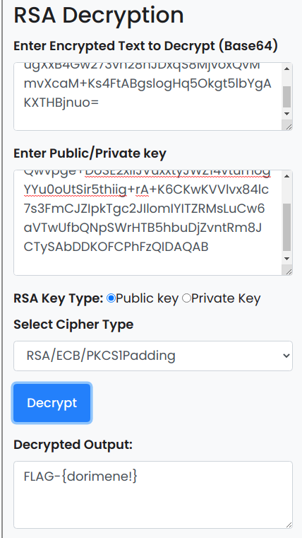
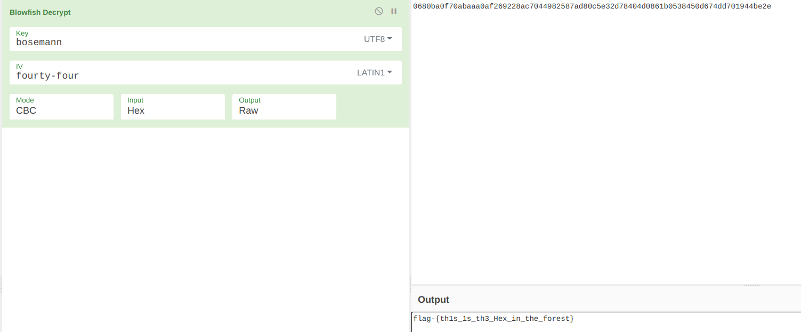
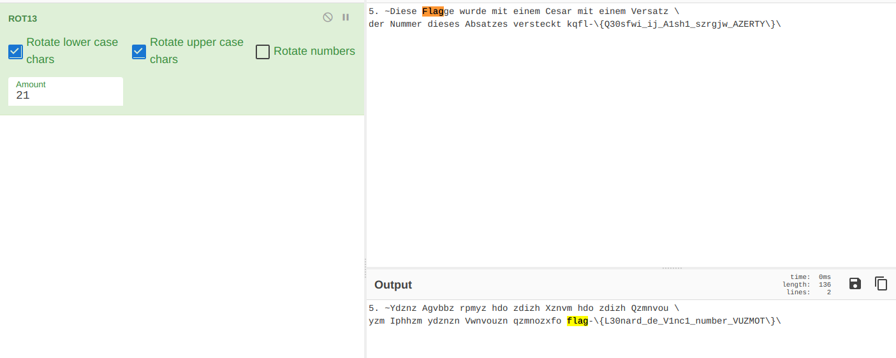
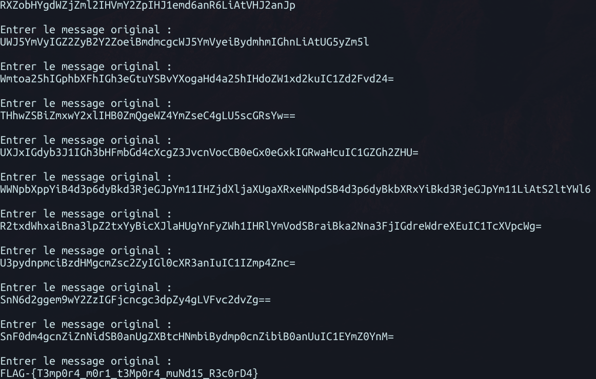

# PolyCTF 2021 

###### 20-02-2021 | Online | Jeopardy
###### Organizers : PolyHx (Polytechnique Montreal)
###### Final placement: 17/~200


# Web
## TIMEIO

For this challenge, since it's using an unknown host (time.ctf), we need to add it to our hosts list:

~~~shell
> cat /etc/hosts

# Static table lookup for hostnames.
# See hosts(5) for details.
127.0.0.1	localhost
::1		localhost
127.0.1.1	arch.localdomain	arch # I use arch btw

3.141.95.219 	time.ctf
~~~

The flag is on the very bottom of the source code:

## Formula

The challenge specs were as follows: 
> Mathematicians are not the best web developpers...

If we enter the website we see a page that displays a mathematic formula (written in [MathML](https://developer.mozilla.org/en-US/docs/Web/MathML)), as well as an input box asking us to rewrite something like that formula above.

If we snoop around the dev tools, we also see that we are given a cookie upon entering the page: ```secret=here```

Also, if we enter something in the input box and send the result. It will redirect to a page containing the parsed HTML inputted and another button stating something along the lines of showing this to our admins, further solidifying the idea that this is indeed an XSS challenge.

Right off the bat, if we're given an input box, we should try to test some common XSS payloads:

```
<script>alert(1)</script>

<embed src="evil.com">
...
```
However, all of the inputs were being sanitized properly with the possible xss elements either being stripped of their potential dangerous parameters  or completely removed from the DOM. It was possible however, to input tags, since things like ```<button>``` or other form of markdown worked.

Furthermore, since the challenge asked to recreate the formula written, it could have to do with MathML.

After trying a bunch of things, I managed to find some more information on MathML.

In essence, MathML falls in the same category as SVG whereby it changes the namespace of the elements generated in the HTML by the parser. The HTML Parser creates elements based on three namespaces, that of html, svg and mathml.

On top of that, this challenges uses DOMPurify to sanitize the inputs and this is where the attack vector is.

The way DOMPurify works is, simply put, as follows:

The HTML is parsed -> DOMPurify sanitizes it -> Reparsed (parsing ➡️ serialization ➡️ parsing)

However, the problem with that is that it's possible that the sanitzed DOM differs and ruins the integrity of the initial parsed HTML, which then could imply the possibility of a mutated XSS attack. 

[A lot more can be read here about the attack vector](https://research.securitum.com/mutation-xss-via-mathml-mutation-dompurify-2-0-17-bypass/)

Now, the idea of switching namespaces comes into play here. Because we're handling DOM elements from different namespaces, they will be parsed differently. Meaning that something like this for example: ```<style><a>ABC</style><svg><style><a>ABC```
could result in a DOM like this:


(Also all of this is from the link previously provided)

In the image, we see that the svg contains an svg style with an svg anchor, yet those are not real html elements. They were incorrectly parsed after being serialized by DOMPurify. 

Knowing this, we need to also understand that there are elements in the different namespaces that force the parser to switch back to the HTML namespace, elements such as ```mtext``` in MathML. This makes it possible to possible to generate contents of different namespaces, when nested within elements of another namespace

Finally, the article also provides a payload:
```
<form><math><mtext></form><form><mglyph><style></math>
```

If we analyze this, it is creating a DOMTree as such:

~~~html
<form>
	<math>
		<mtext>
			<html form>
				<html mglyph>
					<html style>
						text
						</math>
					
~~~

**Why this works**:

This works, because every element in the DOMPurify *allow list* are respected, since the serialization doesnt take into account the ``````, because in this payload, it is serialized as text and not as an html element, because of the namespace switching.

### TLDR :
Because the page sanitizes the inputs that contain possible xss enabling parameters, it uses some sort of sanitizer like DOMPurify. DOMPurify however induces a vulnerability where sanitized HTML is not parsed the same way as it was initially parsed, introducing the possibility of mutated XSS attacks through DOM manipulation using HTML elements of different namespaces, in this case MathML. 

If we enter this payload, we indeed get script executed, since an alert box does pop up. Great, now we need to find the flag. Often times, the flag will be in the cookies of the victim, in this case the admins of the website. Also, the cookie that we have states ```secret=here```, which also proves the idea that we need the victims cookies.

Perfect, there are multiple ways to do this, since we have script execution. We could set up an HTTP Server, or use a webhook service online such as [Webhook.site](https://webhook.site/). We now need to rewrite the payload so that it send the cookies somehow: 

```
<form><math><mtext></form><form><mglyph><style></math>
```

This will result in a request like this from the hosted server:


The flag is indeed in the request url!

```
FLAG-{i3nt_mUtation_X55_1nt3resting}
```

#### Note: Since the challenge page is down, because I'm writting this after the CTF, I don't have any screenshots, but I will update this as soon as I have the source code for the challenge.


# Crypto
## [Desjardins] Crypto Challenge 1

For this challenge, two strings were given and the challenge specs mentionned:

> Rivest, Shamir and Adleman offer you this key:
```
MIGfMA0GCSqGSIb3DQEBAQUAA4GNADCBiQKBgQClBhktGHYjjMAM4ddiPtM2xxQwvpge+DoSE2xiiJVuxxtyJWZ14vtumogYYu0oUtSir5thiig+rA+K6CKwKVVlvx84lc7s3FmCJZIpkTgc2JIlomIYITZRMsLuCw6aVTwUfbQNpSWrHTB5hbuDjZvntRm8JCTySAbDDKOFCPhFzQIDAQAB

``` 
> Then, the president of Desjardins sends you this message:
```
gj7cZOUJK1XeKjVeqG+DYh8l9mRucS9b43zZkzvvBpsNVxgfxxlHB68t7Wl/Vn0zMjPRzybGfTNZBtrHygON0tDbsRBMfUVcfRppugXxB4Gw273vn28nJDxqS8MjvoxQvMmvXcaM+Ks4FtABgslogHq5Okgt5lbYgAKXTHBjnuo=
```

Right off the bat, it's not hard to notice that the names of the people that gave you the key spell out RSA when putting their initials together. [RSA](https://simple.wikipedia.org/wiki/RSA_algorithm) is an assymetric ecryption algorithm, meaning that it has two different keys - a public key and a private key. The public key can be given to anyone, they will use that key to encrypt messages that they want you to see, because only a specific private key will be able to decrypt the message encrypted with a public key. In this case, the public key is the one that Rivest, Shamir and Adleman gave you and the encrypted message is the one from the President of Desjardins. There are numerous decrypters online, [I chose this one](https://www.devglan.com/online-tools/rsa-encryption-decryption).

Make sure to set the RSA key type to public:



Here we go: ```FLAG-{dorimene!}``` !

## [Desjardins] Crypto Challenge 2

This challenge gives us a string:
```
gdag1fhRRyFCW84AjjtXoFFAFV8qUvG4+aHXY2Dt+q2vk48pvsW06SA5TW1KbKiJXKliSm/wKdenWZS39+Dp2tAYeE5GgxD6g3LU+HF/C9Pi/vJ5218Arrwyev6WXH66GhQAI+0R12kR2tBRl7AZN8NwXg82GHtG6JmYKR+jdaQrSOrJS9nMNtLvAGkW6sOtClaqHSxx4J5vXdVAj2u6ANlhG61THOTaSiAzDJ6Momg3AC0m8oX3U5/8DnohptgX4ES0FzgURnGvHjlZwikcnaD8OM3ty0Qjc1qDTd/eXNxXvMPBDcmSwrKDO8k3hCsISdDOxXlaa15t2irIzw1xtnjPqE+zWFPcJ+r9Bekn1MFw8yFk6uxYmOfYyGtBst1JhwuJm3EOQqS0JqDm2dzdj1EA2L7pdfLlobcn8sy85FoHMzI7Pf5x1v6UD2DHIngQf1nao5S/dKWNFz2HbrkSywG382GLS3H/KR6Ep0NtMt7j7aQfnZUtFQoKITP6EiIQNd1E10KMtiCmFPIOyP+UoVJRb+dEkrsHbtHbZL9YVR4dnd3/W4b0j3DrpSKgILpHX6lb62TXycZjfjPR3+v40BLjamxKlPxhHEJRODjXbwGKsXbfvTfQAX/Hyg3fOYv4aguShVqZNubtEZO9CQKXKQ==
```
And states that a historian gave us this encrypted message, which was encrypted using *a very popular* algorithm that was released in **1998** and that we needed to decrypt it using the last flag as key. After a bit of research, I found four rather popular encryption algorithms that came out in 1998: Twofish, AES, CS-Cipher and COCONUT98.

Because of the little information I had for the challenge and for the algorithms, I eliminated CS-Cipher & COCONUT98, but was left with AES and Twofish. AES has many forms, but the one I was interested by was AES-128, because of the 16 byte key that I had found in the previous challenge. Since I didn't have an IV, I had to use the [ECB mode of operation](https://en.wikipedia.org/wiki/Block_cipher_mode_of_operation#Electronic_codebook_(ECB)). 
There are numerous decrypters online, [I chose this one](https://encode-decode.com/aes-128-ecb-encrypt-online/).

With the parameters as:


We get the flag: ```FLAG-{cooperation}```!

It's important to also note down or read carefully the resulting message, because it contains the hint "Alphonse Desjardins", that is used for the next challenge.

## [Desjardins] Crypto Challenge 3

For this one, the challenge spec gave us a string:
```
Dfoks! Mona oign ftyjsb i frucisvv lx koets rt Zzgxvseg. Dcjv momzs pwzhjvv pxzgbpbsapv, lx Uchxsatrk dxa Qnkggtw Uelroefwbh ijt nv gluhsbi ue viwfusg hyi lx ucqgzs rsfpxzogkt tdrue em TYCU-{gxbuevmaotsaxpvnxctpgbh} eei Aexvbpgs Sijjtzrvpg o Aimil ii Dwsptg,Tagirn. Ecbhmuekms ccf zp vvvnm gcgqwppzsxm Hug Pocovr vwazg z'ici uel xzhu waesittvhru wbhxztnbwbpg txrrnvqsegg oj qfnwm. Rr rzih, pv Mhcjrosbi Hvscifqkbg umxukm stczsbiet iifzk zsh gvnm usvnzsjvj efxzbasigw ru fwbqg gsase lx uotcnwci Wokjsf.

```

And says: 
> Using the word found in the flag of the Desjardins' historian message, what does the message on this poster mean?

Right off the bat we see: ```TYCU-{gxbuevmaotsaxpvnxctpgbh}```. Which means that it's a caesar cipher, since this has the exact shape of the flag we want. The only caesar cipher I know of that uses a key is [Vignere Cipher](https://en.wikipedia.org/wiki/Vigen%C3%A8re_cipher). There are numerous decoders online, [I chose this one](https://gchq.github.io/CyberChef/).

And here we go:


We get the flag: ```FLAG-{sixdecembremileneufcent}```!


## [Desjardins] Crypto Challenge 4

Suprisingly, this had very little solves. The challenge spec was: 
> A Desjardins employee tells you that according to the NSA, this former stenographer in Ottawa only had one cat (Chat in french).

Here, "one cat" in french becomes "un chat", which reads out as "un sha", hence meaning that we need to do something with SHA1.
I attempted to encrypt a bunch of stuff and submit, but nothing worked, until I used the name that found before Alphonse Desjardins". Encrypting it and putting the encrypted text inside of curly braces with the FLAG prefix gives us the flag:

```FLAG-{4f5feb845589394f668a1d7d09cbea95f28852a1}```

## [Desjardins] HextySixtyMany

This challenge did not give any spec. It only had an RTF File, which contained the following: 

```
4e 57 45 67 4e 6d 51 67 4e 7a 67 67 4e 6a 67 67 4e 57 45 67 4e 7a 6b 67 4d 7a 45 67 4d 7a 63 67 4e 6a 51 67 4e 44 63 67 4e 6a 63 67 4e 7a 67 67 4e 6a 4d 67 4d 7a 45 67 4d 7a 67 67 4e 7a 63 67 4e 6a 49 67 4e 6d 45 67 4e 47 55 67 4e 6a 59 67 4e 47 51 67 4e 54 67 67 4e 47 55 67 4e 6a 59 67 4e 54 6b 67 4e 54 59 67 4d 7a 6b 67 4e 6a 6b 67 4e 47 51 67 4e 54 67 67 4e 54 49 67 4e 6a 59 67 4e 6a 45 67 4e 44 63 67 4e 44 59 67 4e 7a 6b 67 4e 57 45 67 4e 44 51 67 4e 47 55 67 4e 7a 6b 67 4e 6a 59 67 4e 54 45 67 4d 32 51 67 4d 32 51 3d
```

If we decode the Hex, we get:

```
NWEgNmQgNzggNjggNWEgNzkgMzEgMzcgNjQgNDcgNjcgNzggNjMgMzEgMzggNzcgNjIgNmEgNGUgNjYgNGQgNTggNGUgNjYgNTkgNTYgMzkgNjkgNGQgNTggNTIgNjYgNjEgNDcgNDYgNzkgNWEgNDQgNGUgNzkgNjYgNTEgM2QgM2Q=
```

Which is Base64. Decoding the Base64, we get another chain of hex and decoding that hex we get the flag:

Here is the series of transformation:


And we get the flag: ```flag-{th1s_0n3_1s_a_b1t_hard3r}``` !

<br>

## [Desjardins] Hex in the Forest
For this challenge, the spec gives us an RTF File with this 

> 


If we try the same thing as the previous challenge, meaning decode the hex, we get :

```
Nice try, but this is not the hex in the file. You must catch the blowfish using the bosemann key. If you speak Latin, then ask the Cyber-Chef on the CBC using the forty-four iv, to find the raw hex salad that is found in the forest.
0680ba0f70abaaa0af269228ac7044982587ad80c5e32d78404d0861b0538450d674dd701944be2e
```

Alright, this made it very easy. Here are the keywords:

- blowfish
- bosemann key
- Latin
- forty-four iv
- CBC
- 0680ba0f70abaaa0af269228ac7044982587ad80c5e32d78404d0861b0538450d674dd701944be2e

These mean that we are using the blowfish encryption algorithm, using "bosemann" as the key, "Latin" as the key format, using the CBC Mode of operation, since we are given the IV (forty-four).

Pluging all of that into CyberChef:



# Steganography

## [Desjardins] QR
For this challenge we are given a QR Code. If we use a [QR Reader](https://eqrcode.co/a/6cOsNt), we get the flag: ```flag-{Ah!_ c0mme_la_ne1ge@neigé!}```

## [Desjardins] Leonardo
### Note: For these next few challenges, I honestly couldn't remember which flag belonged to which challenge, therefore all of the flags will be listed under this section.

For this challenge, we are given an RTF File. If we read the contents we see a 99 page document containing some foreign language.

If instead we cat the file and grep using case insensitive and match all regexp for the word "flag", we get:
~~~sh
❯ cat Anmerkungen-zur-Transkription.rtf | grep -ie "flag"
      gesperrt: \cf2 flag-\{L30nard_de_V1nc1_number01of05\}\cf0 \
[Illustration: Flag. 3.] ZmxhZy17TDMwbmFyZF9kZV9WMW5jMV9udW1iZXIwMzgyNDYzMDJ9\
5. ~Diese Flagge wurde mit einem Cesar mit einem Versatz \
         gibt in der neuen Auflage seiner Princ. of mechanism. \'fcbrigens\
nutzbar zu machen. -- Leonardo da Vinci flag-\{L30nard_de_V1nc1_betrachtet\}\
~~~

So we have two flags right off the bat, the first one is ```flag-{L30nard_de_V1nc1_number01of05}```, the second one ```flag-{L30nard_de_V1nc1_betrachtet}```. 

Furtheremore, if we open up the file inside of a text editor and search for the word flag, we get:
```
5. ~Diese Flagge wurde mit einem Cesar mit einem Versatz \
der Nummer dieses Absatzes versteckt kqfl-\{Q30sfwi_ij_A1sh1_szrgjw_AZERTY\}\
```

Which looks awfully close to a flag, but rotated, so let's fix that: 


With a simple ROT21, we get the third flag: ```flag-{L30nard_de_V1nc1_number_VUZMOT}```

One of the challenges also stated that there was a hidden picture inside of the file. Conveniently, if we search some more for the word flag in the text editor (i.e.: in vscode), we see

```
[Illustration: Flag. 3.] ZmxhZy17TDMwbmFyZF9kZV9WMW5jMV9udW1iZXIwMzgyNDYzMDJ9\
[Illustration: Fig. 4.]\
```

The text appears to be B64, if we decode with we get the 4th flag: ```flag-{L30nard_de_V1nc1_number038246302}```

At the very end of the file, we also get this string of hex codes: 
```
66 6c 61 67 2d 7b 4c 33 30 6e 61 72 64 5f 64 65 5f 56 31 6e 63 31 5f 6e 75 6d 62 65 72 30 34 39 38 37 36 35 42 41 7d
```

If we decode it we get the fifth and final flag: ```flag-{L30nard_de_V1nc1_number0498765BA}```

# Programming
## Math Challenge

The challenge is to solve a series of verbal equations and return the answer to all of them within a certain timeframe.

Example input:


Each equation would come in one at time through the connections. For this solve, I used a package called [Inflect](https://pypi.org/project/inflect/) to generate a dictionary of verbal numbers and their corresponding integer:

~~~python
num_words = {}

for i in range(0, 10000):
    index = '{0:04}'.format(i)
    word_form = p.number_to_words(i)
    word_form = word_form.replace(",", "")

	# Because there are some orthographic mistakes, I need to modify some things
	
	
	# This is because it would for some reason add "zero" if the number's last two integers were 0 (ie.: 5700 would be five thousands zero)
    if(index[2] == '0' and index[3] == '0'): 
        word_form += " zero"

	# For example if the number was 570, which is supposed to read five hundred seventy, but if it was 170 it would read one hundred seventy. So it would only change it for plural hundreds... if that makes sense.
	# So I have to manually change all the inputs to use "hundreds", if and only if there are many hundreds (Ie: 100 will still be One Hundred)
    if(index[1] != '1'): 
        word_form = word_form.replace("hundred", "hundreds")

    if(index[0] != '1'):
        word_form = word_form.replace("thousand", "thousands")

		# More orthographic mistakes, where 40s would be written as fourty instead of forty...
    word_form = word_form.replace("forty", "fourty")
    word_list = word_form.split()
    remove_list = ['and']
    tmp = ' '.join([i for i in word_list if i not in remove_list])
    num_words[tmp] = i
~~~

This would generate a dictionary like this:

~~~python
{'zero': 0, 'one': 1, 'two': 2, 'three': 3, 'four': 4, 'five': 5, 'six': 6, 'seven': 7, 'eight': 8, 'nine': 9 }

And so on for the next 10000 integers.
~~~

Onwards, the solve was pretty straight forward: Read the input, parse it to generate an actual equation, eval it, send it, repeat 10 times. It was also mentionned that the output needed to be max 2 decimals.

~~~python
for i in range(0, 10):
    # Read the input
    inpt = r.recv().decode("utf-8")
    inpt.strip()
    inpt.replace("\n","")
    formula = createFormula(inpt.splitlines(True)[2])

    # Dont hardcode, its bad. Im just lazy
    firstNumber = num_words[formula[0]]
    secondNumber = num_words[formula[2]]
    thirdNumber = num_words[formula[4]]
    firstOperation = operDict.get(formula[1])
    secondOperation = operDict.get(formula[3])

    evalString = str(firstNumber) + str(firstOperation) + str(secondNumber) + str(secondOperation) + str(thirdNumber)
    output = eval(evalString)
    r.sendline(str("{:.2f}".format(output))) # Two decimals

print(r.recv())
r.close()
~~~

There we go: ```FLAG-{quick maths, that's pretty good :)_ahGaiR3g}``` !


## Caesar
Connecting to the socket, we get this message:


The challenge spec was to solve the message (decode it) and send back the plaintext within a timeframe.

If we decode the initial string for example:
~~~shell
$ echo "TXhmaWhrdCB4bWJndmJ3bmdtIHR3YmlibHZiIHhtYmd2YnduZ20gdGViam50ZiBneGpueCBneGpueC4gLVZ0eGx0aw==" | base64 -d
$ Mxfihkt xmbgvbwngm twbiblvb xmbgvbwngm tebjntf gxjnx gxjnx. -Vtxltk
~~~

We see that it's a caesar cipher. Typically, they're ROT13 ciphers, but in this case, it cipher could change.

For this one, the cipher is rotated 7 times, to give us this string:

```
Tempora etincidunt adipisci etincidunt aliquam neque neque. -Caesar
```

If we send this one, we get correct output.

Therefore, since we don't know how many times the string is rotated, but we know that the string must contain the substring 
"-Caesar", then we simply have to bruteforce the rotation for as long as we don't have a resulting string that contains the needed word:


~~~typescript
let dataArr = [];
client.on("data", (data) => {
	let strData = data.toString("utf-8");
    console.log(strData);
    dataArr.push(strData);
    if(dataArr.length % 2 === 0) { 
        let b64decoded = base64.decode(dataArr[0])		// First we Base64 Decode it.
        let rotdecoded = "";					// Then set the ROT decoded string to empty
        for(let i = 0; i < 26; i++) {				// ROT Decode the initial string until we get a substring -Caesar
            rotdecoded = rot(b64decoded, i);
            if(rotdecoded.includes("-Caesar")) {
                client.write(rotdecoded);			// Send the decoded ROT string;
                dataArr = [];		 			// Repeat
            }
        }
    }
});

~~~

Executing script, we get:



There we go: ``` FLAG-{T3mp0r4_m0r1_t3Mp0r4_muNd15_R3c0rD4}``` !

## Brainfudge

For this challenge, the spec is STDIn will contain an string array of numbers that are in memory. Our job is to change those numbers to represent ascii values of the message ```"Hello world!"```

The catch is that we need to return the code used to do that task, written in [Brainfuck](https://en.wikipedia.org/wiki/Brainfuck). If you don't know brainfuck, it's not *that* complicated, you can refer to [this gist](https://gist.github.com/roachhd/dce54bec8ba55fb17d3a) that explains it pretty well.

Regardless, the first part of the challenge consists of actually decoding the message that is returned. This can be done easily, since the input is already parsable into an array.

~~~typescript
let dataArr = [];
client.on("data", (data) => {
	let strData = data.toString("utf-8")
	console.log(strData);
	dataArr.push(strData);
		[...]
	let codes = JSON.parse(dataArr[0]);
		[...]
~~~

We now have an array containing the 12 bytes of memory sent to us. Now we need to compare it with the actual data we want the memory to contain and send it back.

For that, we know that the resulting memory array is supposed to be an array of charcodes derived from the ascii values of the "Hello world!" string. We can write the ascii codes:

~~~typescript
let helloworldCharCodes: number[] = [];
let hw = "Hello world!";
for (let i = 0; i < hw.length; i++) {
  helloworldCharCodes.push(hw.charCodeAt(i));
}
~~~

Now all that is left is to convert each code into the respective number and print it.

In short, we can increase a value in brainfuck using the "+" character, decrease it using the "-" character and moveover or moveback using the ">" and "<" characters respectively. Finally, we can also print the current memory block using the "." character.

Our goal is to generate the brainfuck code that will allow us to increase or decrease each memory block until we reach the same ascii value as the one for each character of the "Hello world!" string, then print the memory block's output to stdout and moveover to the next one. For each memory block, we will append the resulting brainfuck code. Great, now that we know the algorithm, here's the code:


~~~typescript
let bfCode = "";
    codes.forEach((code, index) => {
      let tmp = "";
      while (code != helloworldCharCodes[index]) {
        if (code < helloworldCharCodes[index]) {
          tmp += "+";
          code++;
        } else if (code > helloworldCharCodes[index]) {
          tmp += "-";
          code--;
        }
      }
      if(index != helloworldCharCodes.length - 1) {
        tmp += ".>"
      } else tmp += "."
      bfCode += tmp;
    });
~~~

And thats about it! Here's the output:


As you can see, the code is long, but it's all on one line to respect the challenge spec.

Here we go: ```FLAG-{TH3_B35T_PR0GR4MM1NG_L4NGU4G3_EV3R_M4D3}```
